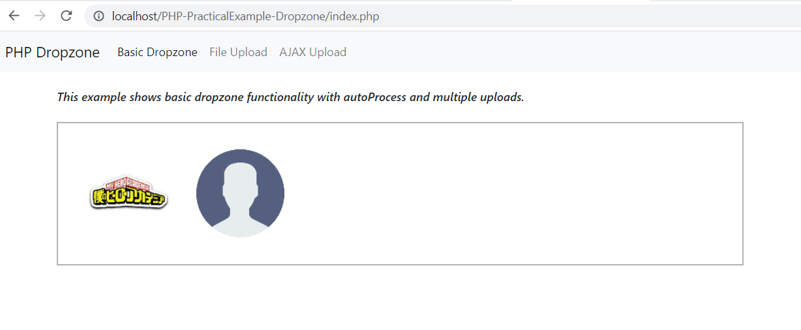
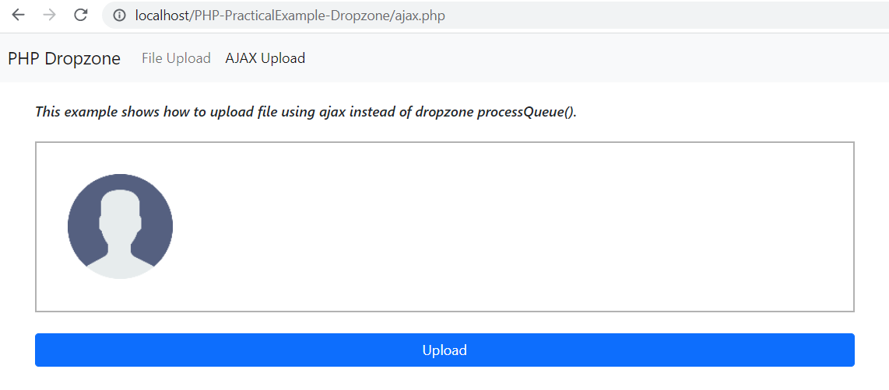

# PHP-PracticalExample-Dropzone

- This is a practical example of using PHP - Dropzone File Upload

- **Vanilla PHP** just means plain original PHP without any framework.

- [**Bootstrap 5**](https://getbootstrap.com/docs/5.0/getting-started/introduction/) is the newest version of Bootstrap, which is the most popular HTML, CSS, and JavaScript framework for creating responsive, mobile-first websites.

- [**jQuery**](https://jquery.com/) is a fast, small, and feature-rich JavaScript library. It makes things like HTML document traversal and manipulation, event handling, animation, and Ajax much simpler with an easy-to-use API that works across a multitude of browsers.

## Dropzone File Upload

- [**Dropzone.js**](https://www.dropzone.dev/) - is one of the most popular drag and drop JavaScript libraries. It is free, fully open source, and makes it easy for you to handle dropped files on your website.

## Screenshots

### This is a basic application of dropzone. Simply drag/drop or upload to dropzone box and file will automatically be uploaded to dropzone_upload folder.

### This example will show autoProcessQueue disabled, and max of 1 file upload. When button is clicked, the file will be uploaded via rocessQueue() dropzone method.

### This example will show same autoProcessQueue disabled and max of 1 file. But the uploading process will be done via JQuery AJAX to upload.php
